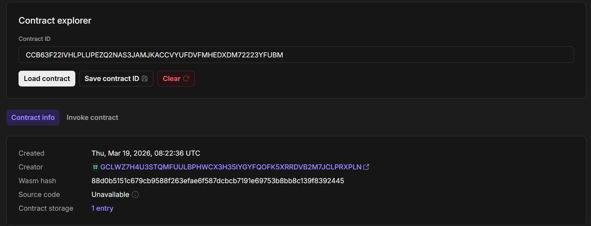

# ⏳ Time-Locked Savings (Soroban Smart Contract)

## 📌 Project Description
Time-Locked Savings is a decentralized savings mechanism built on the Stellar Soroban smart contract platform. It allows users to lock their funds for a specified period of time, preventing withdrawals until the lock duration has passed.

This concept encourages disciplined saving and can be used for personal finance goals, milestone-based savings, or even trustless escrow-like systems.

---

## ⚙️ What it does
- Users can deposit an amount into the contract.
- While depositing, they specify an **unlock timestamp**.
- Funds remain locked until the specified time.
- Users can only withdraw their funds **after the unlock time**.
- The contract securely stores deposit data on-chain.

---

## ✨ Features
- 🔐 **Time-based locking** of funds
- 👤 **User-specific deposits**
- ⛔ **Prevents early withdrawals**
- 📦 **On-chain storage using Soroban**
- 🔎 **View deposit details anytime**
- 🧩 Simple and extensible design for future upgrades

---

## 🚀 Future Enhancements
- Add token transfers (actual XLM or custom token integration)
- Support multiple deposits per user
- Add penalty for early withdrawal (optional)
- Interest/reward mechanism for long-term savings
- UI dashboard for users

---

## 🔗 Deployed Smart Contract Link

---

## 🛠️ Tech Stack
- Rust
- Soroban SDK
- Stellar Blockchain

---
## Contract ID
CDISWIGZSPUMARCPAOEPMZYB53HR3BFZ2EIHA4GXIOID6YSCPAU53TCP

---
## 🌐 Deployed Smart Contract Link
🔗 https://lab.stellar.org/r/testnet/contract/CCB63F22IVHLPLUPEZQ2NAS3JAMJKACCVYUFDVFMHEDXDM72223YFUBM
